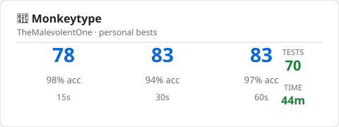

<!-- Welcome Section -->

  <!-- Welcome -->
  <picture>
    <source media="(prefers-color-scheme: dark)"
      srcset="https://readme-typing-svg.demolab.com?font=Consolas&amp;weight=100&amp;size=30&amp;pause=1000&amp;color=56FF5A&amp;center=true&amp;vCenter=true&amp;repeat=false&amp;width=435&amp;lines=Welcome+To+My+Profile!">
    <source media="(prefers-color-scheme: light)"
      srcset="https://readme-typing-svg.demolab.com?font=Consolas&amp;weight=100&amp;size=30&amp;pause=1000&amp;color=007BFF&amp;center=true&amp;vCenter=true&amp;repeat=false&amp;width=435&amp;lines=Welcome+To+My+Profile!">
    
  </picture>

   

  <!-- Profile Description -->
  <picture>
    <source
      media="(prefers-color-scheme: dark)"
      srcset="https://placehold.co/500x75/transparent/56FF5A?font=source-sans-pro&amp;text=BSc%20(Hons)%20Software%20Engineering%20Student">
    <source
      media="(prefers-color-scheme: light)"
      srcset="https://placehold.co/500x75/transparent/007BFF?font=source-sans-pro&amp;text=BSc%20(Hons)%20Software%20Engineering%20Student">
    
  </picture>

   

  <!-- Animated Gif Section -->
  <kbd>
    <picture>
      <source
        media="(prefers-color-scheme: dark)"
        srcset="https://i.giphy.com/PTBVMsYIOB0SBP4MVe.webp"
        width="250"
      >
      <source
        media="(prefers-color-scheme: light)"
        srcset="https://media0.giphy.com/media/v1.Y2lkPTc5MGI3NjExcWhyYTFpejd0Zm9sbDZxZWNnaWllbmViN2c4OWZzdmRuYTN6ZW1wYiZlcD12MV9pbnRlcm5hbF9naWZfYnlfaWQmY3Q9Zw/scZPhLqaVOM1qG4lT9/giphy.webp"
        width="250"
      >
      
    </picture>
  </kbd>

   

  <!-- Profile View Counter -->
  <picture>
    <source
      media="(prefers-color-scheme: dark)"
      srcset="https://hits.sh/github.com/TheMalevolentOne1.svg?style=flat&amp;label=Profile%20views&amp;labelColor=0A0A0A&amp;color=56FF5A">
    <source
      media="(prefers-color-scheme: light)"
      srcset="https://hits.sh/github.com/TheMalevolentOne1.svg?style=flat&amp;label=Profile%20views&amp;labelColor=E5E7EB&amp;color=007BFF">
    
  </picture>

<!-- Monkey Typing Statistics -->
<h3 align="center">
🙈 MonkeyType Stats <picture><source media="(prefers-color-scheme: dark)" srcset="assets/flashing_cursor_dark.svg"><source media="(prefers-color-scheme: light)" srcset="assets/flashing_cursor_light.svg"></picture></picture>
</h3>

  <a href="https://monkeytype.com/profile/TheMalevolentOne">
    <picture>
      <source media="(prefers-color-scheme: dark)" srcset="assets/monkeytype-dark.svg">
      <source media="(prefers-color-scheme: light)" srcset="assets/monkeytype-light.svg">
      
    </picture>
  </a>
   
  <a href="https://github.com/TheMalevolentOne1/TheMalevolentOne1/blob/main/.github/workflows/update-monkeytype.yml">Updates every 6 hours.</a>

 

<!-- GitHub Statistics -->
<h3 align="center">
  📊 GitHub Stats
</h3>

<!-- Stats Card -->

<picture>
  <source media="(prefers-color-scheme: dark)" srcset="profile/stats-dark.svg">
  <source media="(prefers-color-scheme: light)" srcset="profile/stats-light.svg">
  
</picture>

<!-- Streak Card -->

<picture>
  <source media="(prefers-color-scheme: dark)" srcset="profile/streak-dark.svg">
  <source media="(prefers-color-scheme: light)" srcset="profile/streak-light.svg">
  
</picture>

<!-- Top Languages -->

<picture>
  <source media="(prefers-color-scheme: dark)" srcset="profile/top-langs-dark.svg">
  <source media="(prefers-color-scheme: light)" srcset="profile/top-langs-light.svg">
  
    Statistics above include Private Repositories
</picture>

 

<!-- Tech Stack Section (icons only, centred, each links to official docs) -->
<h3 align="center">
  💻 Tech Stack
</h3>

  <b>Languages</b>

  &nbsp;&nbsp;
  &nbsp;&nbsp;
  &nbsp;&nbsp;
  &nbsp;&nbsp;
  &nbsp;&nbsp;
  

  <b>Frameworks &amp; Runtimes</b>

  &nbsp;&nbsp;
  &nbsp;&nbsp;
  &nbsp;&nbsp;
  

  <b>Databases</b>

  &nbsp;&nbsp;
  &nbsp;&nbsp;
  &nbsp;&nbsp;
  &nbsp;&nbsp;
  

  <b>DevOps, Cloud &amp; Tooling</b>

  &nbsp;&nbsp;
  <a href="https://docs.github.com/en" target="_blank" title="GitHub">
    <picture>
      <source media="(prefers-color-scheme: dark)" srcset="https://cdn.simpleicons.org/github/FFFFFF">
      <source media="(prefers-color-scheme: light)" srcset="https://cdn.simpleicons.org/github/181717">
      
    </picture>
  </a>&nbsp;&nbsp;
  &nbsp;&nbsp;
  &nbsp;&nbsp;
  &nbsp;&nbsp;
  &nbsp;&nbsp;
  

  <b>Security Tools</b>

  &nbsp;&nbsp;
  &nbsp;&nbsp;
  &nbsp;&nbsp;
  &nbsp;&nbsp;
  <a href="https://www.metasploit.com/" target="_blank" title="Metasploit">
    <picture>
      <source media="(prefers-color-scheme: dark)" srcset="https://cdn.simpleicons.org/metasploit/FFFFFF">
      <source media="(prefers-color-scheme: light)" srcset="https://cdn.simpleicons.org/metasploit/2596CD">
      
    </picture>
  </a>
  

  <b>Security Platforms</b>

  <a href="https://academy.hackthebox.com/" target="_blank" title="HackTheBox">
    <picture>
      <source media="(prefers-color-scheme: dark)" srcset="https://cdn.simpleicons.org/HackTheBox">
      <source media="(prefers-color-scheme: light)" srcset="https://cdn.simpleicons.org/HackTheBox/007BFF">
      
    </picture>
  </a>&nbsp;
  <a href="https://tryhackme.com/" target="_blank" title="TryHackMe">
    <picture>
      <source media="(prefers-color-scheme: dark)" srcset="https://cdn.simpleicons.org/TryHackMe/56FF5A">
      <source media="(prefers-color-scheme: light)" srcset="https://cdn.simpleicons.org/TryHackMe/007BFF">
      
    </picture>
  </a>

 

<h3 align="center">
  <!-- My Notes Collection Website -->
  📚 My Notes Collection
</h3>

My collection of study notes, guides, and CTF write-ups covering cyber security, networking, and full-stack development.

 

  <a href="https://themalevolentone1.github.io/My-Notes-Collection" target="_blank">
    <picture>
      <source media="(prefers-color-scheme: dark)" srcset="https://img.shields.io/badge/Explore%20My%20Notes%20Collection-1C2526?style=for-the-badge&logo=mdnwebdocs&logoColor=56FF5A">
      <source media="(prefers-color-scheme: light)" srcset="https://img.shields.io/badge/Explore%20My%20Notes%20Collection-1C2526?style=for-the-badge&logo=mdnwebdocs&logoColor=007BFF">
      
    </picture>
  </a>

  <a href="https://themalevolentone1.github.io/My-Notes-Collection/Notes/Notes/" target="_blank" title="Notes">
    <picture>
      <source media="(prefers-color-scheme: dark)" srcset="https://img.shields.io/badge/🛡️_Notes-56FF5A?style=flat-square">
      <source media="(prefers-color-scheme: light)" srcset="https://img.shields.io/badge/🛡️_Notes-007BFF?style=flat-square">
      
    </picture>
  </a>&nbsp;
  <a href="https://themalevolentone1.github.io/My-Notes-Collection/Guides/Guides/" target="_blank" title="Guides">
    <picture>
      <source media="(prefers-color-scheme: dark)" srcset="https://img.shields.io/badge/📚_Guides-56FF5A?style=flat-square">
      <source media="(prefers-color-scheme: light)" srcset="https://img.shields.io/badge/📚_Guides-007BFF?style=flat-square">
      
    </picture>
  </a>&nbsp;
  <a href="https://themalevolentone1.github.io/My-Notes-Collection/Video%20Notes/Video%20Notes/" target="_blank" title="Video Notes">
    <picture>
      <source media="(prefers-color-scheme: dark)" srcset="https://img.shields.io/badge/🎥_Video_Notes-56FF5A?style=flat-square">
      <source media="(prefers-color-scheme: light)" srcset="https://img.shields.io/badge/🎥_Video_Notes-007BFF?style=flat-square">
      
    </picture>
  </a>&nbsp;
  <a href="https://themalevolentone1.github.io/My-Notes-Collection/Notes/Cyber%20Security/Online/CaptureTheFlags/CTFs/" target="_blank" title="CTFs">
    <picture>
      <source media="(prefers-color-scheme: dark)" srcset="https://img.shields.io/badge/🚩_CTFs-56FF5A?style=flat-square">
      <source media="(prefers-color-scheme: light)" srcset="https://img.shields.io/badge/🚩_CTFs-007BFF?style=flat-square">
      
    </picture>
  </a>

 

<h3 align="center">
  <!-- Social Connections -->
  🌐 Connect with me:
</h3>

  <a href="https://www.instagram.com/tm02504" target="_blank" rel="noopener noreferrer">
    <picture>
      <source media="(prefers-color-scheme: dark)" srcset="https://img.shields.io/badge/Instagram-0A0A0A?style=for-the-badge&amp;logo=instagram&amp;logoColor=56FF5A">
      <source media="(prefers-color-scheme: light)" srcset="https://img.shields.io/badge/Instagram-0A0A0A?style=for-the-badge&amp;logo=instagram&amp;logoColor=007BFF">
      
    </picture>
  </a>
  <a href="https://stackoverflow.com/users/17998613/the-malevolent-one" target="_blank" rel="noopener noreferrer">
    <picture>
      <source media="(prefers-color-scheme: dark)" srcset="https://img.shields.io/badge/Stack_Overflow-0A0A0A?style=for-the-badge&amp;logo=stackoverflow&amp;logoColor=56FF5A">
      <source media="(prefers-color-scheme: light)" srcset="https://img.shields.io/badge/Stack_Overflow-0A0A0A?style=for-the-badge&amp;logo=stackoverflow&amp;logoColor=007BFF">
      
    </picture>
  </a>
  <a href="https://www.codewars.com/users/The%20Malevolent%20One" target="_blank" rel="noopener noreferrer">
    <picture>
      <source media="(prefers-color-scheme: dark)" srcset="https://img.shields.io/badge/CodeWars-0A0A0A?style=for-the-badge&amp;logo=codewars&amp;logoColor=56FF5A">
      <source media="(prefers-color-scheme: light)" srcset="https://img.shields.io/badge/CodeWars-0A0A0A?style=for-the-badge&amp;logo=codewars&amp;logoColor=007BFF">
      
    </picture>
  </a>
  <a href="https://discord.com/users/TheMalevolent2" target="_blank" rel="noopener noreferrer">
    <picture>
      <source media="(prefers-color-scheme: dark)" srcset="https://img.shields.io/badge/Discord-0A0A0A?style=for-the-badge&amp;logo=discord&amp;logoColor=56FF5A">
      <source media="(prefers-color-scheme: light)" srcset="https://img.shields.io/badge/Discord-0A0A0A?style=for-the-badge&amp;logo=discord&amp;logoColor=007BFF">
      
    </picture>
  </a>
  <a href="https://www.hackerrank.com/profile/TheMalevolent1" target="_blank" rel="noopener noreferrer">
    <picture>
      <source media="(prefers-color-scheme: dark)" srcset="https://img.shields.io/badge/HackerRank-0A0A0A?style=for-the-badge&amp;logo=hackerrank&amp;logoColor=56FF5A">
      <source media="(prefers-color-scheme: light)" srcset="https://img.shields.io/badge/HackerRank-0A0A0A?style=for-the-badge&amp;logo=hackerrank&amp;logoColor=007BFF">
      
    </picture>
  </a>
  <a href="https://leetcode.com/u/themalevolentone1" target="_blank" rel="noopener noreferrer">
    <picture>
      <source media="(prefers-color-scheme: dark)" srcset="https://img.shields.io/badge/LeetCode-0A0A0A?style=for-the-badge&amp;logo=leetcode&amp;logoColor=56FF5A">
      <source media="(prefers-color-scheme: light)" srcset="https://img.shields.io/badge/LeetCode-0A0A0A?style=for-the-badge&amp;logo=leetcode&amp;logoColor=007BFF">
      
    </picture>
  </a>
  <a href="https://www.codecademy.com/profiles/theMalevolentOne8957693335" target="_blank" rel="noopener noreferrer">
    <picture>
      <source media="(prefers-color-scheme: dark)" srcset="https://img.shields.io/badge/Codecademy-0A0A0A?style=for-the-badge&amp;logo=codecademy&amp;logoColor=56FF5A">
      <source media="(prefers-color-scheme: light)" srcset="https://img.shields.io/badge/Codecademy-0A0A0A?style=for-the-badge&amp;logo=codecademy&amp;logoColor=007BFF">
      
    </picture>
  </a>
  <a href="https://academy.hackthebox.com/" target="_blank" rel="noopener noreferrer">
    <picture>
      <source media="(prefers-color-scheme: dark)" srcset="https://img.shields.io/badge/HackTheBox-0A0A0A?style=for-the-badge&amp;logo=hackthebox&amp;logoColor=56FF5A">
      <source media="(prefers-color-scheme: light)" srcset="https://img.shields.io/badge/HackTheBox-0A0A0A?style=for-the-badge&amp;logo=hackthebox&amp;logoColor=007BFF">
      
    </picture>
  </a>
  <a href="https://tryhackme.com/" target="_blank" rel="noopener noreferrer">
    <picture>
      <source media="(prefers-color-scheme: dark)" srcset="https://img.shields.io/badge/TryHackMe-0A0A0A?style=for-the-badge&amp;logo=tryhackme&amp;logoColor=56FF5A">
      <source media="(prefers-color-scheme: light)" srcset="https://img.shields.io/badge/TryHackMe-0A0A0A?style=for-the-badge&amp;logo=tryhackme&amp;logoColor=007BFF">
      
    </picture>
  </a>

<!-- Closing Section -->

  <picture>
    <source media="(prefers-color-scheme: dark)" 
      srcset="https://readme-typing-svg.demolab.com?font=Consolas&amp;weight=100&amp;size=15&amp;pause=1000&amp;color=56FF5A&amp;center=true&amp;vCenter=true&amp;repeat=false&amp;width=435&amp;lines=Thanks+for+checking+out+my+profile!">
    <source media="(prefers-color-scheme: light)" 
      srcset="https://readme-typing-svg.demolab.com?font=Consolas&amp;weight=100&amp;size=15&amp;pause=1000&amp;color=007BFF&amp;center=true&amp;vCenter=true&amp;repeat=false&amp;width=435&amp;lines=Thanks+for+checking+out+my+profile!">
    
  </picture>

  <a href="https://github.com/settings/appearance" target="_blank" rel="noopener noreferrer">
    <picture>
      <!-- Dark Mode -->
      <source media="(prefers-color-scheme: dark)" srcset="https://img.shields.io/badge/Change%20Your%20Theme-%230A0A0A?style=for-the-badge&amp;logo=github&amp;logoColor=56FF5A">
      <!-- Light Mode -->
      <source media="(prefers-color-scheme: light)" srcset="https://img.shields.io/badge/Change%20Your%20Theme-%230A0A0A?style=for-the-badge&amp;logo=github&amp;logoColor=007BFF">
      
    </picture>
  </a>

  This profile looks different in Light and Dark Mode!

